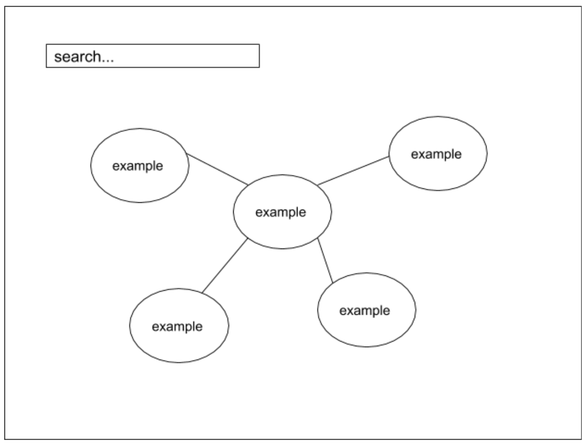

# Word Graph

* [Live Site](https://word-graph.herokuapp.com/)
* [Background and Overview](#background-and-overview)
* [Functionality and MVP Features](#functionality-and-mvp-features)
* [Architecture and Technologies](#architecture-and-technologies)
* [Implementation Timeline](#implementation-timeline)

## Background and Overview

Word graph is a word association/analysis visualization tool.

## Functionality and MVP Features

WordCloud will allow users to:
* [ ] Display a graph of words and associated words
* [ ] Search for words on a search bar
* [ ] Zoom in to associated words
* [ ] Word definitions on hover

## Architecture and Technologies

### Technologies
* Vanilla JavaScript for overall structure of the webpage.
* D3 for DOM manipulation and rendering of data visualizations.
* Cola to layout graphs in a bounded canvas.
* Webpack to bundle and serve up various scripts.

### Wireframe

## Implementation Timeline

* The most important category
  * Display visualizations on the data

* Daily breakdown

10/30/2018
* Create project skeleton
* Go through d3 tutorials
* Create database backend if needed

10/31/2018
* Create API interface
* Create visualization

11/1/2018
* Create search bar

11/2/2018
* Add CSS Styling

Over the weekend
* Add word definitions

## Additional Planned Features
* [ ] Animated visualizations
* [ ] Word cloud
* [ ] Word analysis
* [ ] Allow users to input multiple words